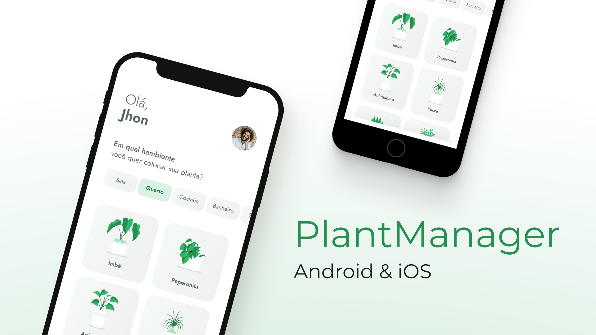

<div align="center" id="top"> 
  

  &#xa0;

</div>

<h1 align="center">PlantManager</h1>

<p align="center">
  

  

  

  
</p>

<p align="center">
  <a href="#dart-sobre">Sobre</a> &#xa0; | &#xa0; 
  <a href="#sparkles-funcionalidades">Funcionalidades</a> &#xa0; | &#xa0;
  <a href="#rocket-tecnologias">Tecnologias</a> &#xa0; | &#xa0;
  <a href="#white_check_mark-pré-requesitos">Pré requisitos</a> &#xa0; | &#xa0;
  <a href="#checkered_flag-começando">Começando</a> &#xa0; | &#xa0;
  <a href="#memo-licença">Licença</a> &#xa0; | &#xa0;
  <a href="https://github.com/weescoelho" target="_blank">Autor</a>
</p>

<br>

## :dart: Sobre ##

Plantmanager é um aplicativo que auxilia as pessoas a lembrarem de regar suas plantinhas. Este projeto foi criado durante a NLW#5

## :sparkles: Funcionalidades ##

:heavy_check_mark: Agendar regas;\
:heavy_check_mark: Notificação para iniciar regas;\
:heavy_check_mark: Selecionar plantas favoritas;

## :rocket: Tecnologias ##

As seguintes ferramentas foram usadas na construção do projeto:

- [Expo](https://expo.io/)
- [Node.js](https://nodejs.org/en/)
- [React](https://pt-br.reactjs.org/)
- [React Native](https://reactnative.dev/)
- [TypeScript](https://www.typescriptlang.org/)

## :white_check_mark: Pré requisitos ##

Antes de começar :checkered_flag:, você precisa ter o [Git](https://git-scm.com) e o [Node](https://nodejs.org/en/) instalados em sua maquina.

## :checkered_flag: Começando ##

```bash
# Clone este repositório
$ git clone https://github.com/weescoelho/plantmanager-app

# Entre na pasta
$ cd plantmanager-app

# Instale as dependências
$ yarn

# Instale o json-server

$ npm install -g json-server

# Inicie a API Fake
$ json-server --watch server.json --port 3004

# Para iniciar o projeto
$ yarn start

# O app vai inicializar em <http://localhost:3000>
```

## :memo: Licença ##

Feito com :heart: por <a href="https://github.com/weescoelho" target="_blank">Weslley Coelho</a>

&#xa0;

<a href="#top">Voltar para o topo</a>
